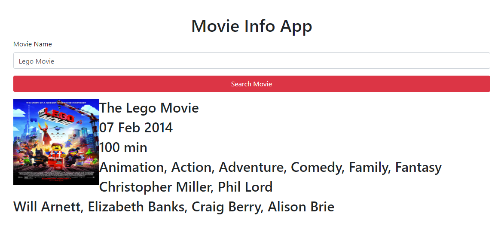

# Movie Info

This app was built to utilize the OMDb API.

## Description

The app is a simple user interface that can take a user input of a movie title and search the OMDb datastore and show the results on the page. The app will show a picture of the movie as well as some basic information the user may be looking for.

Example of content returned:
* Title	"The Lego Movie"				
* Released	"07 Feb 2014"			
* Runtime	"100 min"			
* Genre	"Animation, Action, Adventure, Comedy, Family, Fantasy"			
* Director	"Christopher Miller, Phil Lord"			
* Actors	"Will Arnett, Elizabeth Banks, Craig Berry, Alison Brie"

## Link to the site

https://codragon2020.github.io/movie_info/

This site was made with:

## Screenshot of app

